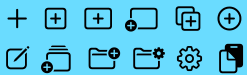
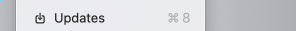

Deze website is een schoolproject!

# Dag 01 (16-02-2026)
## Checkout
Besproken met Arvid

## Wat heb ik gedaan vandaag?
Introductie over de opdracht.
Uitgeschreven wat de eisen zijn en waar ik op wil letten in mijn ontwerp

Artikel 'Progressive enhancement' en 'It's hard to justify Tahoe icons' gelezen:
### Progressive enhancement
Bron: https://www.quirksmode.org/blog/archives/2021/02/progressive_enh_1.html

PE = Progressive Enhancement

In 2008 heeft Aaron Gustafson op de website van A list apart een artikel geschreven/geplaatst, dat gaat over het begrijpen van PE.
Hij inspireerde of verwees naar S. Champeon en N. Finck (hij bedacht het niet zelf). Door Aaron werd het onderwerp populairder.
Hij vergelijkt PE met voorloper(s) daarvan en zegt dat PE de betere aanpak is, dat we nog steeds volgen.

Chris Taylor ziet PE als technical credit (artikel in 2016)
Hier bouw/codeer je noodoplossingen om het systeem snel op te lossen. WEat eerst fout was los je "later" op. (Dit later komt nooit)
PE gaat erover om problemen te voorkomen, zodat je later tijd bespaart.

PE helpt ook met het tegengaan van browserincompatibiliteitsproblemen.
Compatilibiteit = dat apparaten en software probleemloos op elkaar kunnen worden aangesloten.
In 2016 schreven J. Crawford, C. Mills en A. Spivak een artikel hierover, genaamd: "Make the web work for everyone".
Betere browsercompatibiliteit leidt tot betere toegankelijkheid -> betere resultaten. (gebruikers veranderen van website als deze problemen heeft)

Volgens een tellen van Statcount in 2021 heeft Chrome 63% van de gebruikers.
37% gebruikt dus geen Chrome en je wil dat die mensen ook gebruik kunnen maken van jouw website.

In het artikel "The role of enhancement in web design" op de website van Nielsen Norman Group heeft R. Budiu het over dat PE ook nuttig is in niet-technische contexten.
Het artikel geeft overzicht van PE vanuit een UX-perspectief.
UX = user experience
Voorbeeld in het artikel is de muiswiel. Dat was eerst PE en nu nog steeds, omdat touchscreens en toetsenborden geen 'wiel' hebben, maar je wel kan scrollen.

Aaron Walter ontwikkelde het model "Hierarchy of User Needs", dat T. Fessenden als basis gebruikt in haar artikel: "A theory of user delight: Why usability is the foundation for delightful experiences".
A. Walter's Hierarchy of User Needs:

### It's hard to justify Tahoe icons
Bron: https://tonsky.me/blog/tahoe-icons/

HIG = Human Interface Guidelines (1992)

Het is belangrijk om zo min mogelijk icoontjes en graphics te hebben, zodat de gebruiker niet overspoeld wordt en het gebruik overzichtelijker is.

In 2025 bracht Apple het bestuuringssyteem Tahoe uit dat het tegenovergestelde hiervan is. Ieder menu-item heeft een apart icoontje. Het is erg druk en minder overzichtelijk.

Icoontjes helpen om sneller bepaalde dingen te vinden en dus op te vallen. Maar om op te vallen moet je anders zijn. Als alles dan een ander icoontje heeft met dezelfde kleur, valt niks op, en verlies je het overzicht.

Als je op 'cut' wil klikken en je ziet een icoontje van een schaar ernaast ga je de volgende keer op zoek naar een schaar als je 'cut' wil gebruiken.
Tahoe heeft voor ieder menu-item een apart icoontje.
Voorbeeld: (dit zijn allemaal verschillende icoontjes voor 'new')

Vaak wordt hetzelfde icoontje gebruikt voor andere menu-items.
Voorbeeld: (import en updates, twee totaal verschillende dingen en toch hetzelfde icoontje)

Naast dat de icoontjes niet overzichtelijker zijn, zijn ze ook nog eens veel kleiner dan is vorige en/of andere bestuuringssystemen.
Zo had bijv. Windows95 16x16 pixels en Tahoe heeft 12x12 pixels.
Als je dan deze icoontjes probeert te vergroten om te kunnen zien wat er in staat, wordt het een groot zooitje.
Voorbeeld: (20x vergroot)

Een begin gemaakt in de HTML voor de opdracht

Aan Mats gevraagd hoe je in je code en mark kan zetten

## Hoe lang duurde het?
van +/- 09:10 tot 16:00

## Wat heb ik geleerd?
Nieuwe code voor mij is: <fieldset>, <legend> en pattern=""

Van Mats geleerd hoe ik een mark kan zetten voor aantekeningen in de code

Van Jelle een link dat leidt naar de NS-font. Op die manier hoef ik het niet apart op m'n pc te hebben en hoeft het niet op gitignore.

## Wat ga ik morgen doen?

# Dag 02 (17-02-2026)
## Checkout
Besproken met Thomas
Hij heeft in JavaScript ervoor gezorgd dat als je bepaalde vragen neit nodig hebt, deze geskipt worden

## Wat heb ik gedaan vandaag?
Workshop HTML gevolgd bij Victor.

details en summary in de HTML toegevoegd

De checkboxes veranderd voor radio buttons. Want met checkboxes zag ik dat je er meerdere kan aanvinken, maar dat wil ik niet

## Hoe lang duurde het?
Van +/- 09:15 tot 16:30

## Wat heb ik geleerd?
Vandaag niet heel veel nieuws.
Wel dat een fieldset in een fieldset mag

## Wat ga ik morgen doen?
1e les CSS volgen

# Weekoverzicht
## Volledige bronnenlijst:
Progressive enhancement reading list (2021). Geraadpleegd op 16-02-2026 van https://www.quirksmode.org/blog/archives/2021/02/progressive_enh_1.html

It's hard to justify Tahoe icons (2026). Geraadpleegd op 16-02-2026 van https://tonsky.me/blog/tahoe-icons/

Aangifte 2025 Erfbelasting (2025). Geraadpleegd op 16-02-2026 van https://download.belastingdienst.nl/belastingdienst/docs/aangifte_erfbel_2025_suc0602z52fol.pdf

NS (1996). Geraadpleegd op 16-02-2026 van https://www.ns.nl/?utm_source=google&utm_medium=Paid_Search&utm_campaign=NSR-CORP-BR-corporate_C13090&utm_content=&utm_term=ns&utm_id=google_ads_16495705419&gad_source=1&gad_campaignid=16495705419&gbraid=0AAAAADPhMscPjWWI3vSi6V8BraJihnTJl&gclid=CjwKCAiAncvMBhBEEiwA9GU_fti-30alVtLNWP_fT4Or7iASikKIst1hdjk270mZGHsGt4If4pYxQhoC04YQAvD_BwE

# Dag 03 (02-03-2026)
## Checkout
Besproken met

## Wat heb ik gedaan vandaag?
Ik heb geprobeerd om het driehoekje van de details te veranderen in css. Dit werkte niet.
Ik heb het opgezocht en las dat het driehoekje bij details hoort in de browser en niet te veranderen is. Ik kan beter de radio button ja en nee na elkaar schrijven. Apart een div maken voor de extra vragen en deze tervoorschijn laten komen als de gebruiker op ja klikt.

Geprobeerd om de label met ja en nee een value te geven. Dit doet ook niet wat ik wil. Vasilis om hulp gevraagd.
Ik had in de ccs de input benoemd, inplaats het labbel. Ook is het makkelijk om met :has() te werken. Hier had ik zelf niet aan gedacht, maar door de eerste les van css voor de vakantie weet ik wel hoe :has() werkt.

De margin en padding aangepast, zodat de kleur die ik wil verder kwam dan dat het eerst deed.
De teksten de juiste lettertypen en kleuren gegeven.

Ik merk dat het me soms veel tijd kost om bepaalde code te vinden.
Ik ken de code niet uit m'n hoofd. Als ik dan iets wil weet ik wel welke richting op moet zoeken, maar omdat ik de termen (nog) niet kan onthouden kost dit meer tijd.

Vandaag ga ik me inlezen in de bronnen voor clubje 6 op Brightspace voor de Weekly Geek morgen.
Bronnen:
<a href="https://developer.mozilla.org/en-US/docs/Web/Accessibility/ARIA/Reference/Roles/checkbox_role" alt="The Checkbox Role">
<a href="https://developer.mozilla.org/en-US/docs/Web/Accessibility/ARIA/Reference/Roles/radio_role" alt="The Radio Role">
<a href="https://developer.mozilla.org/en-US/docs/Web/HTML/Reference/Elements/input/checkbox" alt="<input type=checkbox>">
<a href="https://developer.mozilla.org/en-US/docs/Web/HTML/Reference/Elements/input/radio" alt="<input type=radio>">
<a href="https://developer.mozilla.org/en-US/docs/Web/HTML/Reference/Elements/label" alt="The Label element">

## Hoe lang duurde het?
+/- van 09:00 tot 16:00

## Wat heb ik geleerd?
Ik heb geen nieuwe code geleerd vandaag.
Maar ik leer wel door te doen. Wat ik weet schrijf ik en meestal werkt het.

## Wat ga ik morgen doen?
Ik wil kijken hoe ik de labels mooi onder elkaar krijg, inplaats alles naast elkaar.
En of een media query nodig is. Ik wil dat alles 1 kolom blijft, ook als de pagina vergroot.

# Dag 04 (03-03-2026)
## Checkout
Besproken met

## Wat heb ik gedaan vandaag?
(max-width inplaats media query)

## Hoe lang duurde het?

## Wat heb ik geleerd?

## Wat ga ik morgen doen?

# Weekoverzicht
## Volledige bronnenlijst: